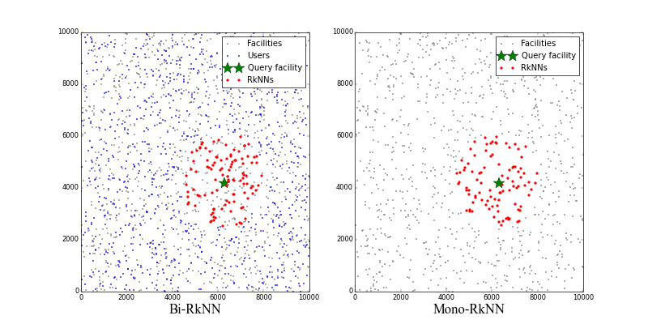

# CSD: Discriminance with Conic Section for Improving Reverse *k* Nearest Neighbors Queries
## Overview
The reverse *k* nearest neighbors (R*k*NN) requires to find every data point that has the query point as one of its *k* closest points. 
According to the characteristics of conic section, we propose a discriminance, named CSD (Conic Section Discriminance), to determine candidates whether belong to the R*k*NN set or not.
With CSD, the vast majority of candidates can be verified with a computational complexity of *O(1)*.
Based on CSD, a novel R*k*NN algorithm CSD-R*k*NN is implemented.
The comparative experiments are  conducted between CSD-R*k*NN and other two state-of-the-art R*k*NN algorithms, SLICE and VR-R*k*NN.
The experimental results indicate that the efficiency of CSD-R*k*NN is significantly higher than the other two algorithms.
## Project structure
```
├── data/: real data set
│   └── us50000.txt
├── common/: common data structures (including Min-heap, Max-heap, Voronoi dagram, Rtree, KDtree, VoRtree and VoKDtree)
│   ├── __init__.py
│   ├── VoronoiDiagram.py
│   ├── Rtree.py
│   ├── KDtree.py
│   ├── VoRtree.py
│   └── VoKDtree.py
├── RkNN/: RkNN algorithms (including CSD-RkNN, SLICE and VR-RkNN)
│   ├── __init__.py
│   ├── CSD.py
│   ├── SLICE.py
│   └── VR.py
└── test/: test benchmarks
    └── benchmark.py
```
## Usage
Generate the facility set and user set:
```python
>>> import numpy as np
>>> from shapely.geometry import Point
>>> bounds = (0, 0, 10000, 10000)
>>> users = [(i, Point(np.random.uniform(bounds[0], bounds[2]), np.random.uniform(bounds[1], bounds[3]))) for i in
             range(1000)]
>>> facilities = [(i, Point(np.random.uniform(bounds[0], bounds[2]), np.random.uniform(bounds[1], bounds[3]))) for i in
                  range(1000)]
```
Index the facilities and users:
```python
>>> from common.VoKDtree import VoKDtreeIndex
>>> user_index = VoKDtreeIndex(bounds[0], bounds[1], bounds[2], bounds[3], users)
>>> facility_index = VoKDtreeIndex(bounds[0], bounds[1], bounds[2], bounds[3], facilities)
```
Retrieve the Bi-R*k*NNs of the (*q*-1)-th facility form the user set:
```python
>>> from RkNN.CSD import BiRkNN, MonoRkNN
>>> q, k = np.random.randint(0, len(facilities)), 10 
>>> bi_rknn = BiRkNN(q, k, facility_index, user_index)
>>> print bi_rknn
[(727, <shapely.geometry.point.Point object at 0x1037d1590>), 
 (175, <shapely.geometry.point.Point object at 0x103796950>), 
 ..., (13, <shapely.geometry.point.Point object at 0x10375f050>)]
```
Retrieve the Mono-R*k*NNs of the (*q*-1)-th facility form the facility set:
```python
>>> mono_rknn = BiRkNN(q, k, facility_index, user_index)
>>> print mono_rknn
[(334, <shapely.geometry.point.Point object at 0x10380dfd0>),
 (906, <shapely.geometry.point.Point object at 0x103850110>),
 ..., (712, <shapely.geometry.point.Point object at 0x103835fd0>)]
```
Plot the result:
```python
>>> import matplotlib.pyplot as plt
>>> from common import plot_points, plot_stars
>>> fig = plt.figure(figsize=(16, 8))
>>> bi_rknn_ax = fig.add_subplot(121)
>>> plot_points(bi_rknn_ax, facilities, 'gray', 4, 'Facilities')
>>> plot_points(bi_rknn_ax, users, 'blue', 4, 'Users')
>>> plot_stars(bi_rknn_ax,[facilities[q]],'green',20,'Query facility')
>>> plot_points(bi_rknn_ax, bi_rknn, 'red', 8, 'RkNNs')
>>> bi_rknn_ax.set_xlabel('Bi-RkNN')
>>> bi_rknn_ax.legend()
>>> mono_rknn_ax = fig.add_subplot(122)
>>> plot_points(mono_rknn_ax, facilities, 'gray', 4, 'Facilities')
>>> plot_stars(mono_rknn_ax,[facilities[q]],'green',20,'Query facility')
>>> plot_points(mono_rknn_ax, mono_rknn, 'red', 8, 'RkNNs')
>>> mono_rknn_ax.set_xlabel('Mono-RkNN')
>>> mono_rknn_ax.legend()
>>> plt.show()
```

## Evaluation
If you want to evaluate the performance of CSD-R*k*NN against other algorithms (e.g., SLICE and VR-R*k*NN), we provide some benchmarks:
```python
from test import benchmark
>>> benchmark.Effect_of_data_size_on_BiRkNN(30) # evaluate the effect of data size on Bi-RkNN
>>> benchmark.Effect_of_data_size_on_MonoRkNN(30) # evaluate the effect of data size on Mono-RkNN
>>> benchmark.Effect_of_k_on_BiRkNN_in_real_distribution(30) # evaluate the effect of k on Bi-RkNN in real distribution
>>> benchmark.Effect_of_k_on_MonoRkNN_in_real_distribution(30) # evaluate the effect of k on Mono-RkNN in real distribution
>>> benchmark.Effect_of_k_on_BiRkNN_in_uniform_distribution(30) # evaluate the effect of k on Bi-RkNN in uniform distribution
>>> benchmark.Effect_of_k_on_MonoRkNN_in_uniform_distribution(30) # evaluate the effect of k on Mono-RkNN in uniform distribution
>>> benchmark.Effect_of_user_num_relative_to_facility_num(30) # evaluate the effect of the number of users relative to the number of facilities on Bi-RkNN
>>> benchmark.Effect_of_distribution(30) # evaluate the effect of data distribution on Bi-RkNN
```